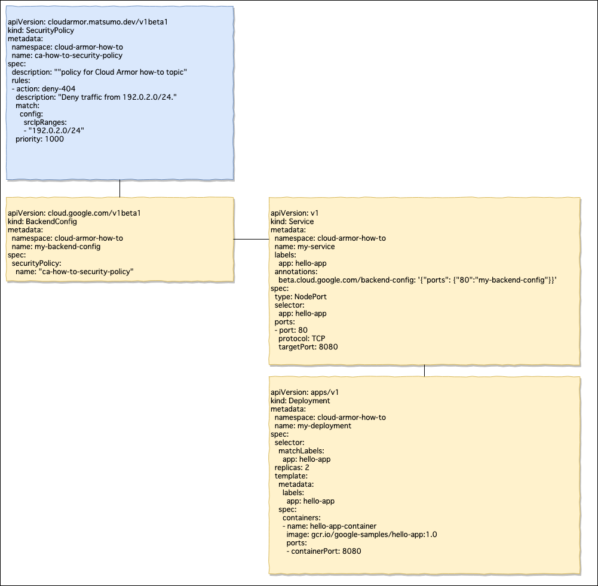

# Security Policy Operator

This is implementation of [Kubernetes Custom Resrouce Definitions]((https://kubernetes.io/docs/concepts/extend-kubernetes/api-extension/custom-resources/#customresourcedefinitions)). 
The Goal is to opearation [Google Cloud Armor Security Policies](https://cloud.google.com/armor/) as a resource of Kubernetes.

The following example implements SecurityPolicy without using gcloud command.

https://cloud.google.com/kubernetes-engine/docs/how-to/cloud-armor-backendconfig

Remember that GKE has [Servive Broker](https://cloud.google.com/kubernetes-engine/docs/concepts/google-cloud-platform-service-broker).

Development using [Kubebuilder](https://book.kubebuilder.io/).

**It is still in development.**
