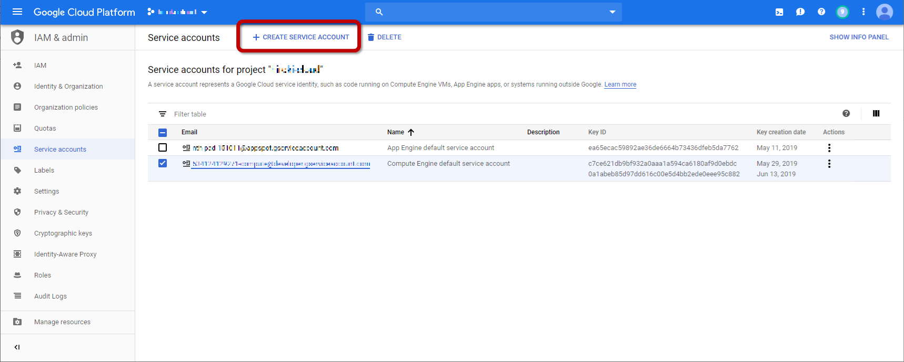
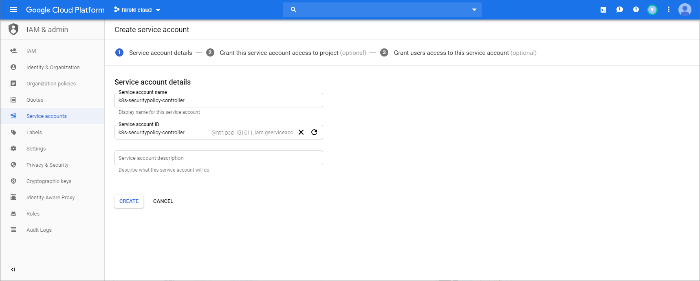
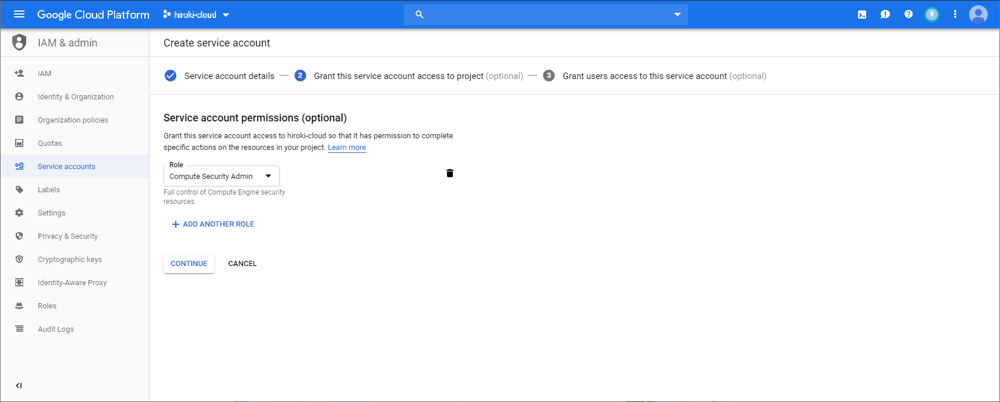
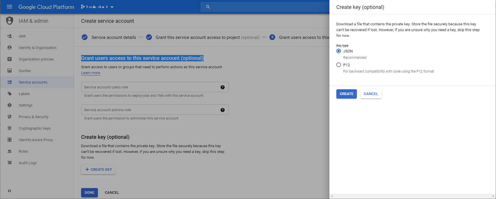

# Security Policy Operator

The Goal is to opearation [Google Cloud Armor Security Policies](https://cloud.google.com/armor/) as a resource of Kubernetes.<br>
Manage SecurityPolicy without using gcloud command.

In the case of the example below, Security Policy Operator realizes management only with yaml.<br>
https://cloud.google.com/kubernetes-engine/docs/how-to/cloud-armor-backendconfig

It has the following configuration.


- This is implementation of [Kubernetes Custom Resrouce Definitions]((https://kubernetes.io/docs/concepts/extend-kubernetes/api-extension/custom-resources/#customresourcedefinitions)).
- Remember that GKE has [Servive Broker](https://cloud.google.com/kubernetes-engine/docs/concepts/google-cloud-platform-service-broker).
- Development using [Kubebuilder](https://book.kubebuilder.io/).

# How to use

## Requirements

This is a requirements to operate Security Policy Operator.

- Google Kubernetes Engine only.
- it works with the service account granted the securityadmin role.<br>

  1. Click **CREATE SERVICE ACCOUNT** button on the Service Account view.


  1. Specify a Service Account Name.


  1. Select Role "Compute Engine → Compute Security Admin".


  1. Download the json private key file.


## Install 

Create a namespace to install Security Policy Operator.
```shell
$ kubectl create namespace security-policy-operator-system
namespace/security-policy-operator-system created
$
```

Create a secret from json file.
```
$ kubectl create secret generic security-policy-operator-key -n security-policy-operator-system --from-file=key.json=PATH-TO-KEY-FILE.json
secret/security-policy-operator-key created
$ 
```

Install Security Policy Operator.
```shell
$ kubectl apply -f https://raw.githubusercontent.com/h-r-k-matsumoto/security-policy-operator/master/dist/install.yaml
customresourcedefinition.apiextensions.k8s.io/securitypolicies.cloudarmor.matsumo.dev created
deployment.extensions/security-policy-operator-controller-manager created
service/security-policy-operator-controller-manager-metrics-service created
rolebinding.rbac.authorization.k8s.io/security-policy-operator-leader-election-rolebinding created
clusterrole.rbac.authorization.k8s.io/security-policy-operator-manager-role created
clusterrolebinding.rbac.authorization.k8s.io/security-policy-operator-manager-rolebinding created
clusterrole.rbac.authorization.k8s.io/security-policy-operator-proxy-role created
clusterrolebinding.rbac.authorization.k8s.io/security-policy-operator-proxy-rolebinding created
$ 
```

## Easy to use

Create sample Security Policy.
```
$ kubectl apply -f https://raw.githubusercontent.com/h-r-k-matsumoto/security-policy-operator/master/config/samples/cloudarmor_v1beta1_securitypolicy.yaml
securitypolicy.cloudarmor.matsumo.dev "securitypolicy-sample" configured
$
```

Delete sample Security Policy.
```
$ kubectl delete -f https://raw.githubusercontent.com/h-r-k-matsumoto/security-policy-operator/master/config/samples/cloudarmor_v1beta1_securitypolicy.yaml
securitypolicy.cloudarmor.matsumo.dev "securitypolicy-sample" deleted
$
```

# Usecase

## Whitelist management with  Kubernetes Custom Resource

T.B.D.


